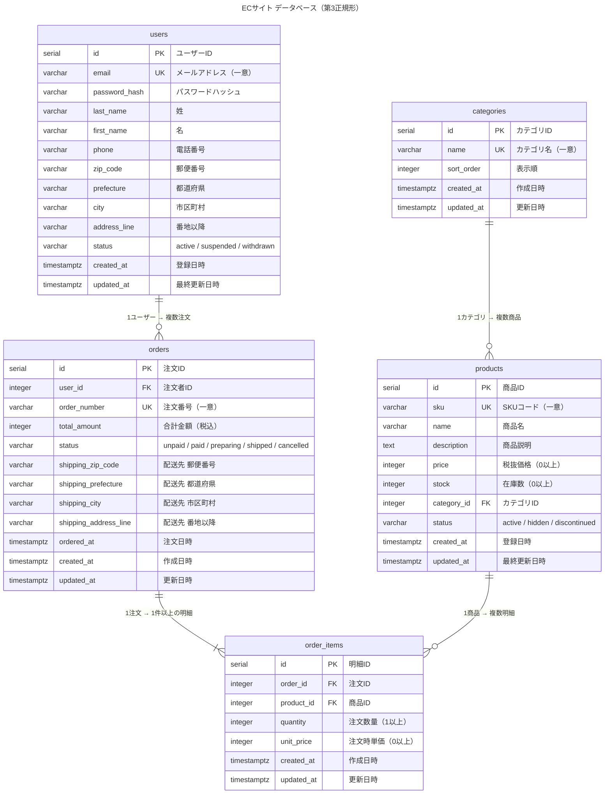

# ER図（Mermaid）

## リレーション一覧

| 親テーブル | 子テーブル | カーディナリティ | 説明 |
|-----------|-----------|----------------|------|
| categories | products | 1 対 多 | 商品は必ず1カテゴリに所属する |
| users | orders | 1 対 多 | 注文は必ず1人の会員に紐づく |
| orders | order_items | 1 対 多（1以上） | 注文には最低1件の明細が必要 |
| products | order_items | 1 対 多 | 明細は必ず1商品を参照する |

## before との差分

| 観点 | before | after |
|------|--------|-------|
| カテゴリ | products.categoryName に直接格納 | categories テーブルに分離、FK で参照 |
| 命名規則 | camelCase と snake_case が混在 | snake_case に統一 |
| 外部キー | 制約なし | 全FK に REFERENCES 定義 |
| インデックス | なし | 検索頻度の高い9カラムに作成 |
| CHECK制約 | なし | status, price, stock, quantity に設定 |
| UNIQUE制約 | なし | email, sku, order_number, (order_id + product_id) |
| VARCHAR桁数 | 無指定 | 全カラムに桁数指定 |
| タイムスタンプ | TIMESTAMP, DEFAULT なし | TIMESTAMPTZ, DEFAULT NOW(), トリガー自動更新 |
| パスワード | password（平文想起） | password_hash（ハッシュ前提） |
