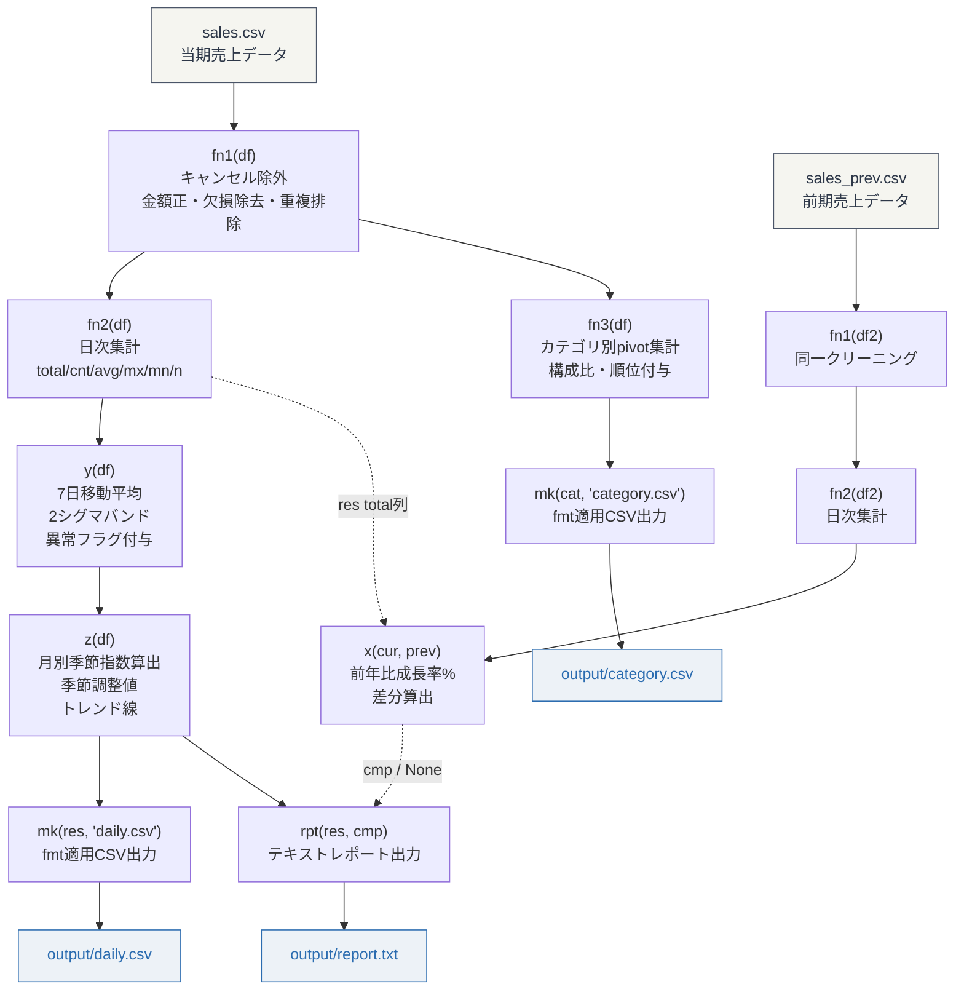

# レガシーコード解析レポート

対象: sales-pipeline/ 配下の6ファイル（Python 3系、pandas/numpy依存）
目的: 売上データの日次集計・統計分析・前年比較・レポート出力パイプライン

---

## 1. ファイル・関数の完全解説

### cfg.py -- 設定・定数定義

パイプライン全体で参照されるパス、カラム名マッピング、パラメータの一元管理ファイル。

| 変数 | 型 | 意味 | 使用箇所 |
|------|------|------|----------|
| P | str | 入力データディレクトリパス（../data/） | F, F2の生成元 |
| O | str | 出力先ディレクトリパス（../output/） | viz.py |
| D | dict | カラム名マッピング。chr(97)-chr(101)で'a'-'e'キーを動的生成 | proc.py全関数 |
| S | dict | Dの逆引き辞書（日本語→1文字キー） | 未使用 |
| F | str | 当期売上CSVパス（sales.csv） | main.py |
| F2 | str | 前期売上CSVパス（sales_prev.csv） | main.py |
| E | str | CSVエンコーディング（utf-8-sig、BOM付きUTF-8） | main.py, viz.py |
| T | float | 0.05。閾値として定義されているが未使用 | 未使用 |
| W | int | 移動平均の窓幅（7日間） | calc.y() |
| Q | list | 四半期区切り月[3,6,9,12]。未使用 | 未使用 |
| _R | dict | "H","M","L"のワンホットベクトル辞書。未使用 | 未使用 |
| _V | lambda | _Rからワンホットを取得。未使用 | 未使用 |

Dの対応表:
- a = 売上日（chr(97)）
- b = 商品名（chr(98)）
- c = カテゴリ（chr(99)）
- d = 金額（chr(100)）
- e = 個数（chr(101)）

特記: `_=os.path;B=_.dirname;J=_.join` でos.pathのメソッドを1文字変数に束ねている。

---

### util.py -- ユーティリティ関数

| 関数 | 推定される本来の名前 | 引数 | 処理内容 | 戻り値 |
|------|----------------------|------|----------|--------|
| chk(x) | validate_date_string | x: 任意の値 | 正規表現で"YYYY-MM-DD"形式を先行チェックし、strptimeでパース。2000-2100年の範囲内か検証。lambda1行で実装 | bool |
| fix(s) | parse_currency_to_float | s: 通貨文字列 or 数値 | int/floatならそのまま返す。文字列なら¥/$/ /カンマを除去して数値化。失敗時は0.0。lambda内包で1行実装 | float |
| fmt(n) | format_number_short | n: 数値 | 100万以上は"1.5M"、1000以上は"12.3K"、それ以下はカンマ区切り。lambda実装 | str |

注意点:
- chk()はパイプライン内で未使用。外部から呼ばれる想定、または呼び出しが削除された残骸
- fix()もパイプライン内で未使用。CSVの金額列が数値型で提供されるようになった後に呼び出しだけ消えたと推測される
- fix()のre.sub内にカンマが2回出現（`,$` と末尾の `,`）。動作に支障はないが冗長
- fmt()のみviz.pyから参照されている

---

### proc.py -- データ前処理・集計

| 関数 | 推定される本来の名前 | 引数 | 処理内容 | 戻り値 |
|------|----------------------|------|----------|--------|
| fn1(df) | filter_valid_orders | df: 売上DataFrame | キャンセル/返品行除外、status列削除、金額0以下除外、売上日・金額のNaN除去、重複排除 | クリーニング済みDataFrame |
| fn2(df, d) | aggregate_daily_totals | df: 売上DataFrame, d: 開始日（任意） | 日付ごとにgroupby集計。辞書内包表記でagg定義を動的生成 | 日次集計DataFrame |
| fn3(df, c) | pivot_by_category | df: 売上DataFrame, c: カテゴリフィルタ（任意） | カテゴリ軸でpivot集計し構成比(pct)と順位(rank)を付与 | カテゴリ別集計DataFrame |

fn1のフィルタ条件（適用順）:
1. statusカラムが存在すれば、"cancelled"/"returned"をisinで除外（三項演算子で分岐）
2. status列をdrop（errors="ignore"で列がなくてもエラーにならない）
3. 金額(D["d"]) > 0
4. 売上日(D["a"])と金額(D["d"])がnotna
5. drop_duplicates
6. reset_index

fn2の出力カラム:

| 出力列名 | 元カラム | 集計方法 |
|----------|----------|----------|
| date | 売上日（.dt.date） | groupbyキー |
| total | 金額 | sum |
| cnt | 個数 | sum |
| avg | 金額 | mean |
| mx | 金額 | max |
| mn | 金額 | min |
| n | 金額 | count |

fn3の出力カラム:

| 出力列名 | 計算 |
|----------|------|
| カテゴリ | pivot index |
| 金額_sum | カテゴリ別金額合計 |
| 金額_mean | カテゴリ別金額平均 |
| 金額_count | カテゴリ別件数 |
| 個数_sum | カテゴリ別個数合計 |
| pct | 金額_sum / 全体金額_sum * 100 |
| rank | 金額_sum降順の順位 |

---

### calc.py -- 統計計算

| 関数 | 推定される本来の名前 | 引数 | 処理内容 | 戻り値 |
|------|----------------------|------|----------|--------|
| x(a, b) | calculate_yoy_growth | a: 当期数値系列, b: 前期数値系列 | 前年同期比の成長率(%)と差分を算出 | DataFrame(cur, prev, g, d) |
| y(df) | add_moving_average_bands | df: 日次集計DataFrame | 7日移動平均、標準偏差、2σバンド、異常フラグを追加 | 元df + ma, std, upper, lower, anomaly列 |
| z(df, t) | apply_seasonal_adjustment | df: 日次集計DataFrame, t: 対象列名(default="total") | 月別季節指数を算出し、季節変動除去値とトレンド線を追加 | 元df + m, si, adj, trend列 |

x()の詳細:
- 2つの系列をpd.Seriesに変換しリスト内包で一括処理
- 長さが異なる場合、短い方に合わせて切り詰める（警告なし）
- g = (cur - prev) / prev * 100（前期が0ならnan）
- d = cur - prev

y()の詳細:
- 対象列の決定: "total" → "sum" → df.columns[1] の優先順で探索（next()使用）
- rolling(window=7, min_periods=1)で移動平均(ma)と標準偏差(std)を算出
- リスト内包で.agg("mean")と.agg("std")を同時に代入
- upper = ma + 2*std、lower = ma - 2*std（統計的管理図の2σルール）
- anomaly = 値がupper超過 or lower未満

z()の詳細:
- 月カラム(m)の決定: dateカラム → 既存のmカラム → 連番%12+1 の3段フォールバック（三項演算子ネスト）
- 月別平均(s)を全月平均(gs)で除算して季節指数(si)を算出
- 季節調整値(adj) = 実績 / 季節指数（si=0のときは実績そのまま）
- トレンド線(trend) = adjの3期移動平均
- df["m"].map(si)を3回計算している（si代入、adj計算の分母、adj計算のゼロチェック）。無駄な再計算

---

### viz.py -- 出力生成

| 関数 | 推定される本来の名前 | 引数 | 処理内容 | 戻り値 |
|------|----------------------|------|----------|--------|
| mk(df, p) | export_summary_csv | df: 任意のDataFrame, p: ファイル名(default="summary.csv") | 数値列をfmt()で整形してCSV出力 | 出力ファイルパス(str) |
| rpt(df, df2) | generate_text_report | df: 日次集計DataFrame, df2: YoY比較DataFrame(任意) | 合計/日次平均/ピーク/前年比をテキスト出力 | 出力ファイルパス(str) |

mk()の注意点:
- リスト内包で`__setitem__`を呼ぶ副作用駆動のスタイル。読みにくいだけで機能は単純
- rank, m, n, cnt列はfmt()を適用しない（整数のまま保持）

rpt()の出力構造:
```
============================================================
  SALES REPORT
============================================================

  Total Sales: {合計}
  Average Daily: {日次平均}
  Peak Day: {最大日}
  Records: {レコード数}

------------------------------------------------------------
  YEAR-OVER-YEAR（df2がある場合のみ）
------------------------------------------------------------
  Avg Growth: {平均成長率}%
  Positive: {成長日数}  Negative: {減少日数}

============================================================
```

---

### main.py -- エントリーポイント

run()がパイプライン全体を制御する。全処理が3行に圧縮されている。

処理順序:
1. pd.read_csv(F) で当期CSVを読み込み
2. fn1() でクリーニング（キャンセル除外、欠損除去、重複排除）
3. fn2() で日次集計（日付ごとのtotal, cnt, avg, mx, mn, n）
4. y() で7日移動平均 + 2σバンド異常検知を追加
5. z() で月別季節調整 + トレンド線を追加
6. fn3() でカテゴリ別集計（fn1済みデータに対して実行。fn2/y/zとは独立）
7. pd.read_csv(F2) で前期CSVを読み込み → fn1 → fn2 → x() で前年比較（try-except、失敗時None）
8. mk() でdaily.csv、category.csvを出力（リスト内包で2回呼び出し）
9. rpt() でreport.txtを生成して返す

---

## 2. データフロー図



---

## 3. リネーム提案

### ファイル名

| 現在 | 提案 | 理由 |
|------|------|------|
| cfg.py | config.py | 略称を正式名称に |
| proc.py | preprocessing.py | データ前処理であることを明示 |
| calc.py | statistics.py | 統計計算であることを明示 |
| viz.py | export.py | 実態はファイル出力であり可視化ではない |
| util.py | formatters.py | 書式変換が主機能（バリデーション関数は未使用） |

### 関数名

| 現在 | 提案 | 所属ファイル |
|------|------|------------|
| fn1(df) | filter_valid_orders(orders_df) | proc.py |
| fn2(df, d) | aggregate_daily_totals(orders_df, start_date=None) | proc.py |
| fn3(df, c) | pivot_by_category(orders_df, category_filter=None) | proc.py |
| x(a, b) | calculate_yoy_growth(current_values, previous_values) | calc.py |
| y(df) | add_moving_average_bands(daily_df) | calc.py |
| z(df, t) | apply_seasonal_adjustment(daily_df, target_column="total") | calc.py |
| mk(df, p) | export_summary_csv(df, filename="summary.csv") | viz.py |
| rpt(df, df2) | generate_text_report(daily_df, yoy_comparison_df=None) | viz.py |
| chk(x) | validate_date_string(date_str) | util.py |
| fix(s) | parse_currency_to_float(value) | util.py |
| fmt(n) | format_number_short(number) | util.py |
| run() | run_sales_pipeline() | main.py |

### 変数名（cfg.py）

| 現在 | 提案 | 備考 |
|------|------|------|
| P | DATA_DIR | |
| O | OUTPUT_DIR | |
| D | COLUMN_MAPPING | chr()生成をやめ、直接辞書リテラルにすべき |
| S | REVERSE_COLUMN_MAPPING | 未使用。削除候補 |
| F | CURRENT_SALES_PATH | |
| F2 | PREVIOUS_SALES_PATH | |
| E | CSV_ENCODING | |
| T | THRESHOLD | 未使用。削除候補 |
| W | MOVING_AVERAGE_WINDOW | |
| Q | QUARTER_MONTHS | 未使用。削除候補 |
| _R | PRIORITY_ONEHOT_MAP | 未使用。削除候補 |
| _V | get_priority_vector | 未使用。削除候補 |

---

## 4. コード品質の問題点

### 可読性

問題1: 全関数・全変数が1-3文字の名前。
コードの意味を推測するしかなく、新規参画者の立ち上がりに丸1日を要する。
対応: 上記リネーム提案に沿って名前を変更する。

問題2: docstringとコメントが皆無。
関数の前提条件、引数の型・制約、戻り値、副作用が一切記述されていない。
対応: Google styleまたはNumPy styleのdocstringを全関数に追加する。

問題3: cfg.pyのカラム名マッピングがchr()による動的生成。
D辞書の構築が `chr(i) for i in range(97,102)` で行われており、キー自体が非自明。
対応: `{"a": "売上日", "b": "商品名", ...}` の直接リテラルに戻す。加えて、`COL_AMOUNT = D["d"]` のような名前付き定数を定義する。

問題4: セミコロンによる1行複文、三項演算子のネスト、リスト内包での副作用利用。
Pythonicとは対極のスタイル。エディタの行幅を超える行が多数あり、水平スクロールなしでは読めない。
対応: PEP 8に沿って改行し、三項演算子はif-else文に展開する。

### 保守性

問題5: fn2()の出力カラム名が文字列リテラルでハードコード。
"total", "cnt", "avg"等の名前をcalc.pyやviz.pyが暗黙に参照している。どこかで名前を変えると連鎖的に壊れる。
対応: 出力カラム名をcfg.pyで定数管理するか、TypedDict/dataclassで型定義する。

問題6: エラーハンドリングがmain.pyのtry-except(Exception)だけ。
proc.pyやcalc.pyの内部エラーも含めて全キャッチする。前年データ読み込みのエラーだけを想定しているが、fn1/fn2のバグもサイレントに握りつぶす。
対応: except句をFileNotFoundErrorに限定する。またはtryの範囲をread_csvだけに絞る。

### バグリスク

問題7: calc.py z()で df["m"].map(si) を3回計算している。
si代入、adj分母、adjゼロチェックの各所で同じ計算を繰り返しており、無駄なだけでなく、siの値がmap時点で変わるリスクがある。
対応: 一度変数に格納して使い回す。

問題8: calc.py z()のフォールバック `pd.Series(range(1,len(df)+1))%12+1`。
len(df)が12を超えると月番号1-12が循環的に割り当てられるが、実データの月と一致する保証がない。
対応: dateカラムがない場合はエラーにするか、明示的にwarningを出す。

問題9: calc.py x()で長さが異なる系列を無言で切り詰める。
当期と前期の営業日数が異なるケースでデータがサイレントに欠落する。
対応: logging.warningで日数差を通知する。

問題10: viz.py mk()でリスト内包の副作用として__setitem__を呼んでいる。
戻り値のリストは使い捨て。メモリの無駄遣いであり、意図が読み取りにくい。
対応: 通常のforループに書き直す。

---

## 5. 技術的負債とリスク

### デッドコード

| 対象 | 場所 | 推定される経緯 |
|------|------|----------------|
| T = 0.05 | cfg.py | 閾値フィルタ用に準備されたまま実装されなかった |
| Q = [3,6,9,12] | cfg.py | 四半期集計の構想があったが未実装 |
| S（逆引き辞書） | cfg.py | 日本語→キー変換が不要になった |
| _R, _V | cfg.py | 優先度分類のワンホット。実装が途中で放棄された |
| chk() | util.py | 日付バリデーションを入口でかける予定だったが組み込まれなかった |
| fix() | util.py | CSVの金額列が数値型になった段階で不要になった |

対応: 未使用コードは削除する。削除を躊躇するならgitの履歴に委ねて、現在のコードからは消す。

### エラーハンドリングの不備

- CSVの読み込みでエンコーディングエラー時のフォールバックがない
- fn2(), fn3()は空のDataFrameを受け取った場合にゼロ除算やKeyErrorが発生しうる
- z()の季節指数計算で gs=0（全データが0）のとき、np.whereで除算回避しているが si=0のまま残るためadj列が不正になる
- fix()の内部lambda `(lambda v: float(v) if v else 0.0)` で v="" のとき float("") がValueErrorを起こす。ただし現在fix()は呼ばれていないため実害はない

### テスト容易性

- 全関数がcfg.pyのグローバル定数に直接依存。テスト時のモックが困難
- viz.pyのファイルI/Oがデータ変換と混在。純粋関数として切り出せない
- 対応: 設定値を引数として注入可能にする。I/O層とデータ変換層を分離する

### 運用リスク

- ログ出力が一切ない。障害時に原因を特定する手段がprint(run())しかない
- main.pyのtry-exceptが全例外をキャッチするため、前年データ処理以外のバグもサイレントに無視される
- 出力ディレクトリの排他制御がない。複数プロセスで同時実行するとCSVが壊れる
- fmt()適用後のCSVは数値が"12.3K"などの文字列になる。後段の処理でこのCSVを数値として読めない

---

## 6. 改善提案の優先度

| 優先度 | 項目 | 工数目安 | 効果 |
|--------|------|----------|------|
| 高 | 関数名・変数名のリネーム | 2h | 可読性が劇的に改善。他の改善の前提条件 |
| 高 | docstring追加 | 2h | 新規メンバーの立ち上がり時間が1日→30分に |
| 高 | デッドコード削除（T, Q, S, _R, _V, chk, fix） | 30m | ノイズ除去。コード量が20%減る |
| 中 | try-exceptの範囲限定 | 30m | バグのサイレント握りつぶしを防止 |
| 中 | z()のmap再計算を解消 | 15m | パフォーマンスと正確性の両方に寄与 |
| 中 | logging導入 | 1h | 運用時の原因特定が可能に |
| 低 | I/O層の分離 | 3h | テスト容易性の向上だが、先にテスト自体を書く必要あり |
| 低 | カラム名の型定義 | 2h | 列名のタイポをコンパイル時に検出できるようになる |
