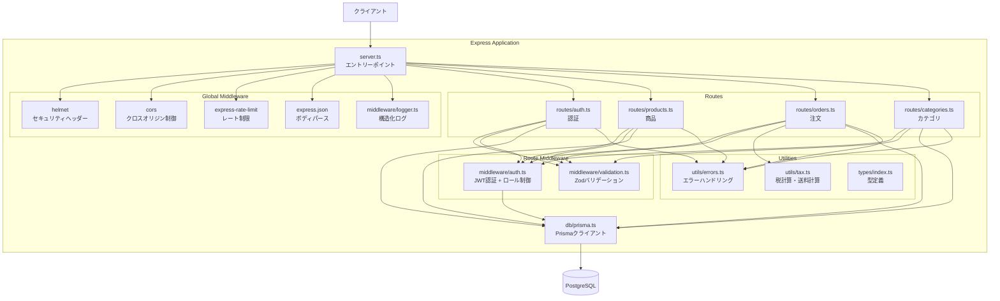
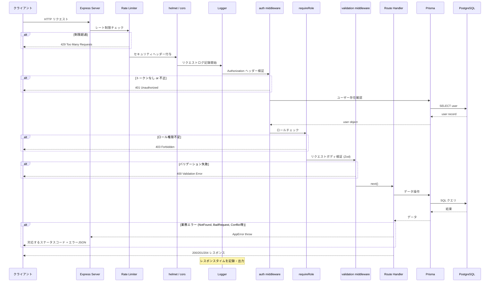
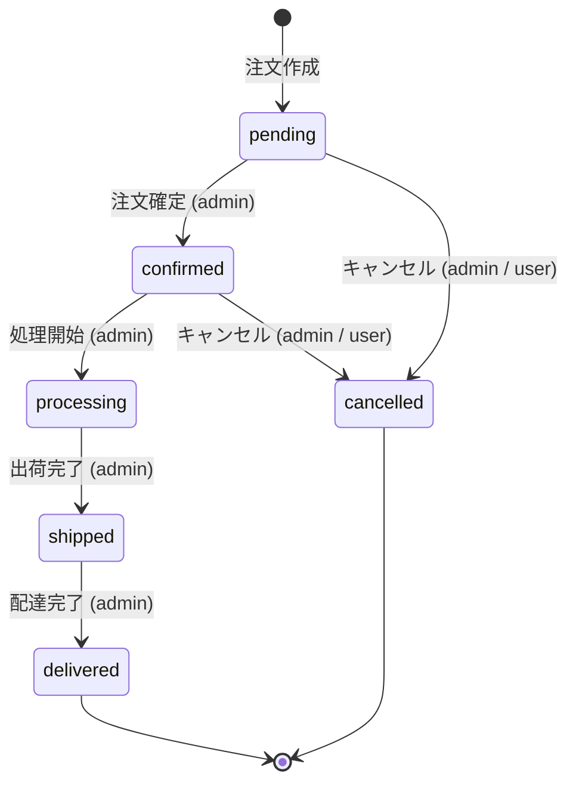
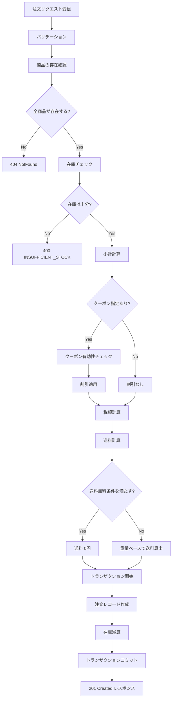

# アーキテクチャ概要

Express + Prisma による3層構成のREST API。ルーティング層、ミドルウェア層、データアクセス層に分離し、ロールベースのアクセス制御と構造化ログを備える。

## コンポーネント構成

## リクエスト処理フロー

認証とロール制御が必要なエンドポイント（例: POST /api/products）にリクエストが到達してからレスポンスが返るまでの流れ。

## 注文ステータス遷移

注文は作成時に pending で始まり、以下の経路で遷移する。一度 cancelled または delivered に到達すると、それ以上の遷移はできない。ユーザー自身によるキャンセル（/api/orders/:id/cancel）は pending と confirmed の状態からのみ可能で、キャンセル時に在庫が復元される。

遷移のルールはコード上で STATUS_TRANSITIONS オブジェクトとして定義されている。

| 現在の状態 | 遷移先 |
|-----------|--------|
| pending | confirmed, cancelled |
| confirmed | processing, cancelled |
| processing | shipped |
| shipped | delivered |
| delivered | なし |
| cancelled | なし |

## 注文作成の処理フロー

注文作成は複数のステップをトランザクション内で実行する。途中で失敗した場合は全ての変更がロールバックされる。

## レイヤー間の責務

### server.ts（エントリーポイント）

グローバルミドルウェアの登録、ルーターのマウント、エラーハンドラの設定、サーバー起動を担う。ビジネスロジックは一切含まない。レート制限の設定もここで行う。

### routes/（ルーティング層）

各リソースのエンドポイント定義とビジネスロジック。ミドルウェアチェインの組み立て（認証要否、ロール制限、バリデーションスキーマの指定）もこのレイヤーで行う。注文ルーターは税・送料計算のユーティリティを呼び出し、トランザクションを管理する。

### middleware/（ミドルウェア層）

横断的関心事を処理する。認証ミドルウェアはJWTの検証とユーザー情報のリクエストオブジェクトへの付与、ロールベースのアクセス制御を担当する。バリデーションミドルウェアはZodスキーマに基づくリクエストボディとクエリパラメータの検証を行う。ロガーミドルウェアは全リクエストの構造化ログを出力する。

### db/（データアクセス層）

Prismaクライアントのシングルトン管理。開発環境でのHot Reload時にコネクションが増殖しないよう、グローバル変数にキャッシュする仕組みを持つ。DB接続チェック用のヘルパー関数も提供する。

### utils/（ユーティリティ）

カスタムエラークラス群とExpressエラーハンドラ。AppErrorを基底クラスとし、各HTTPステータスコードに対応するサブクラスを提供する。エラーコード（code）フィールドによりクライアント側での分岐処理が可能。税計算・送料計算のビジネスロジックもここに配置。税率と送料無料閾値は環境変数で調整できる。

### types/（型定義）

プロジェクト全体で共有される型。OrderStatus の string literal union型、JWTペイロードの型、UserRole、各APIの入出力型が定義されている。
